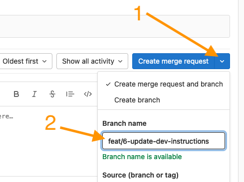
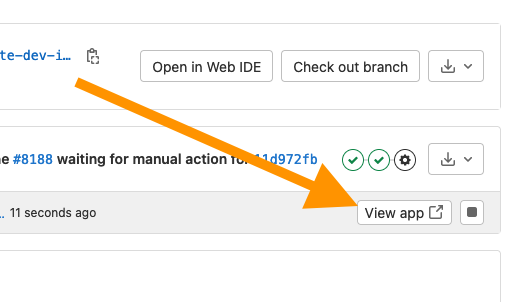
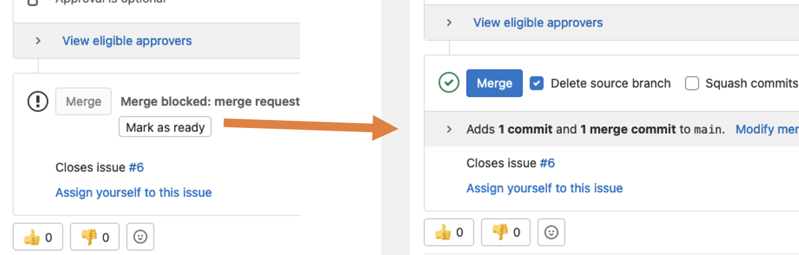

# Course Production Conversion Guide

Welcome to the Conversion Guide for BCIT Course Production!

## In this guide

The Course Production Conversion Guide is an online reference for anybody that develops, produces, or maintains an online course at BCIT.  It provides up-to-date information regarding all of the default tools packaged into the LTC approved course framework.  This includes:

1. Word markers - How to prepare your MS Word document when developing your content
1. HTML - How to use a feature in HTML format
1. Notes - Notes about various features


## For developers

To work on the project, get [Docker Compose](https://docs.docker.com/get-docker/).

1. Create an issue describing the intended change
1. Create a merge request and a branch prefixed with either *feat/* or *fix/*.

    

1. Run `docker compose` to develop and watch changes using browsersync (visit localhost:3000 in your browser).

    ```bash
    docker compose up --build
    ```

1. Commit your changes
1. Preview your changes by clicking the "view app" button on the MR pipeline section

    

1. Request a code review by marking your MR as "ready" and assigning the MR to a reviewer.

    

    When approved, you can merge the MR.

For more information, see the [development documentation](https://stable.dev.ltc.bcit.ca/infrastructure-documentation/).
